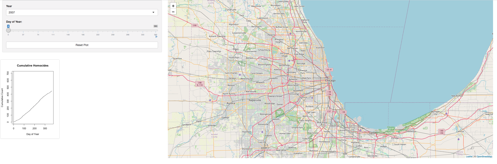
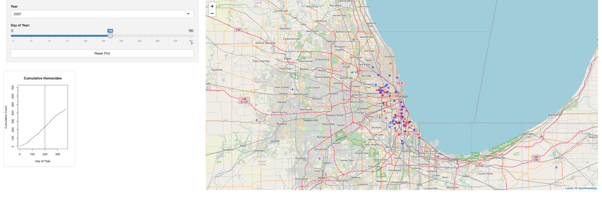

# Chicago Shooting Shiny App

This was my first shiny app development. I used RShiny to develop a webapp to display the Fatal shootings in Chicago through time. This app uses Leaflet to generate a map and has a time slider to show the shootings in a cumulative fashion over the days of the year. The user can then use a drop down menu to select which year they want to display.

I developed this add hoping to generate a data visualization that may prove useful for others curious to see pattern of fatal shootings in the city. I would later go on to develop a much more complex shiny webapp as part of my work at the USGS in 2021. The groundwork for that knowledge was built on this project.

I don't have the webapp hosted, however you can download the code and run it for yourself, in /Homocides/app.R

landing screen screen shot below:

You can see in the screenshot below the interactive nature of the app. Specifically how the cumulative curve and vertical line in that plot tracks the Day of Year Slider.

